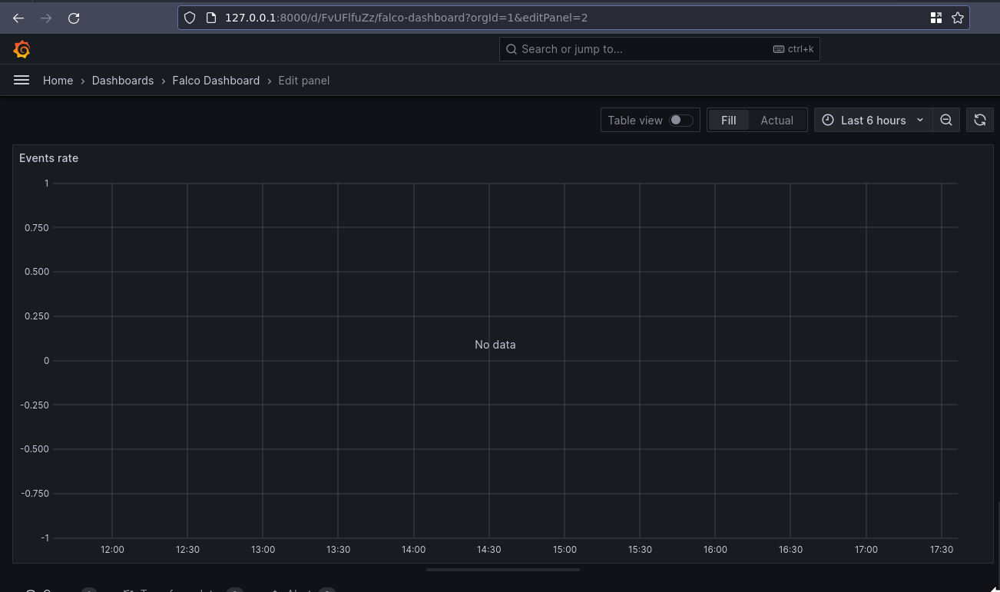
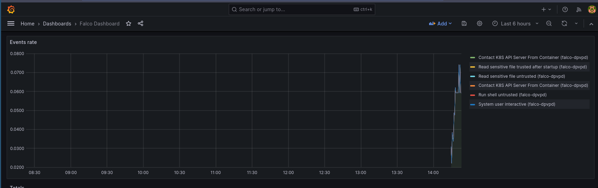

## Intro

I need to read docs better. This post is to give myself a nice copy-paste for next time I want to do the thing I spent today doing, without reading again. 

If anything here is grossly incorrect, please shout at me on Slack or Twitter/X. I love to hear about how I'm wrong. 

## Installing Falco

Today, while trying to set up a simple Kubernetes test cluster involving Falco, Grafana, and Prometheus, I rediscovered the importance in really reading documentation. No one enjoys this, but I absolutely found myself in this situation:



It seemed like an easy problem to solve. Install [Prometheus](https://prometheus.io/), [Grafana](https://grafana.com/), [Falco](https://github.com/falcosecurity/falco), and [Falco-exporter](https://github.com/falcosecurity/falco-exporter). Then I'll have pretty graphs telling me about all of the nefarious tests I'm running on my own machine. Perfect. 

A couple of quick Google searches later, and I ended up on [this blog from Falco in 2020](https://falco.org/blog/falco-kind-prometheus-grafana/). Looks pretty simple to follow and has plenty of commands to copy-paste and get everything working. Unfortunately it turns out there's a load of things which have changed through multiple pesky updates. 

The first warning was the falcoctl cli no longer using the syntax that was expected.

```
❯ FALCOCTL_NAME=falco-grpc.default.svc.cluster.local FALCOCTL_PATH=/tmp/certs falcoctl install tls
Error: unknown command "install" for "falcoctl"
Run 'falcoctl --help' for usage.
 ERRO  unknown command "install" for "falcoctl"
```

Checking the output of `falcoctl --help` (RTFM_Counter++) shows that the current expectation is `falcoctl tls install`. Running `--help` against this also shows that the environment variables included in the KinD/Falco blog are no longer used, and have been replaced by the `--alternate-names` and `--path` flags, accordingly. (RTFM_Counter++, the environment variables actually used are detailed [here](https://github.com/falcosecurity/falcoctl/blob/main/README.md)).

Running `falcoctl tls install -p /tmp/certs/ --alternate-names falco-grpc.default.svc.cluster.local` gets the expected certificate files in the right places. 

The next step was to deploy Falco itself. Copy-pasting the commands from the blog got everything running perfectly. Or so I thought. 

```
helm install falco falcosecurity/falco \
    --set-file certs.server.key=/tmp/certs/server.key,certs.server.crt=/tmp/certs/server.crt,certs.ca.crt=/tmp/certs/ca.crt \
    --set falco.grpc.enabled=true,falco.grpcOutput.enabled=true
```

## Installing Prometheus

So we have events being published. Winner winner. falco-exporter is happy, and connected to the grpc connection started by Falco. Now to have something pick up what we're putting down. 

Installing Prometheus using the recommended stable/prometheus chart threw a load of errors (and the chart itself is deprecated), but thankfully there's a handy [Prometheus Community Chart](https://github.com/prometheus-community/helm-charts/tree/main/charts/kube-prometheus-stack) which has everything we need.  Rather than reading the manual, I happily jumped across to this chart. 

Prometheus ran! And the web interface worked! But I couldn't find out why it wasn't picking up the Falco exporter as an endpoint. Turns out, you have to add a service monitor. That is something you can do manually, but the helpful Falco maintainers have thought of this, so you can also just update the Helm values (RTFM_Count++) to make the Helm chart do this all for you by setting `--set serviceMonitor.enabled=true`. Perfect!

Or not. I could see the service monitor was in place. I could see that the selectors were correct. I checked (RTFM_Counter++) the syntax for selecting a service with multiple labels through `kubectl`. Everything looked good, but I still couldn't get the values to show in Prometheus. Turns out, the documentation warned me about this too (RTFM_Counter++). 

As per [the Prometheus Community documentation](https://github.com/prometheus-community/helm-charts/tree/main/charts/kube-prometheus-stack):

> By default, Prometheus discovers PodMonitors and ServiceMonitors within its namespace, that are labeled with the same release tag as the prometheus-operator release.

Googling around led me to [this GitHub Issue](https://github.com/falcosecurity/falco-exporter/issues/63) (RTFM_Counter++) which then took me to [this Slack thread](https://kubernetes.slack.com/archives/CMWH3EH32/p1619753500281500?thread_ts=1619144955.110600&cid=CMWH3EH32) (RTFM_Counter++), which gave me a couple of thoughts about how to fix this. The Slack author's solution was to add a label to the service monitor with the release name from the Helm chart of prometheus-community, but this seems like a sticking plaster rather than a long-term fix. My far more horrible solution was to add the following value `prometheus.prometheusSpec.serviceMonitorSelectorNilUsesHelmValues=false
` (RTFM_Counter++) to my Prometheus Helm chart, which allowed Prometheus to find and use the falco-exporter service monitor. 

## Installing Grafana

And now we're on the home stretch. Everything just magically works in Prometheus. I can see there are metrics directly on the metrics endpoint (kubectl port-forward svc/falco-exporter 9376, curl 127.0.0.1:9376/metrics, RTFM_Counter++). I can see the target in Prometheus. Now all I need to do is import a Grafana dashboard and watch the pretty graphs roll in.



Turns out that even though the metrics endpoint on the exporter was working, and Prometheus was picking it up, and Grafana could talk to Prometheus, the events weren't actually being published. Large amounts of Googling later, I ended up going from [this GitHub Issue](https://github.com/falcosecurity/falco-exporter/issues/81) to [this PR](https://github.com/falcosecurity/charts/pull/436). Turns out the `--set falco.grpc.enabled=true,falco.grpcOutput.enabled=true` we used in the original Falco chart, should have been `--set falco.grpc.enabled=true,falco.grpc_output.enabled=true`. Yep, it's `grpc_output` not `grpcOutput`. 

Redeploying the Helm chart with the correct output seems to have fixed everything, and now I have a pretty graph! 



## Actual TL;DR

Deploying everything I needed works with the following snippets. I've not tested them on your machine. I've barely tested them on my machine, so don't expect copy-pasting it to just work. But it might, you never know. Give it a shot if you want. And if anyone from the Falco community finds this and feels like updating all the docs, past-me would thank you.

```
# Add Falco chart repo
helm repo add falcosecurity https://falcosecurity.github.io/charts

# Add Prometheus Community repo
helm repo add prometheus-community https://prometheus-community.github.io/helm-charts

# Tell helm to check new repos
helm repo update

# Generate Falco certs
falcoctl tls install -p /tmp/certs/ --alternate-names falco-grpc.default.svc.cluster.local

# Install Falco
helm install --set-file certs.server.key=/tmp/certs/server.key,certs.server.crt=/tmp/certs/server.crt,certs.ca.crt=/tmp/certs/ca.crt --set falco.grpc.enabled=true,falco.grpc_output.enabled=true falco falcosecurity/falco 

# Install Falco Exporter
helm install --set-file certs.ca.crt=/tmp/certs/ca.crt,certs.client.key=/tmp/certs/client.key,certs.client.crt=/tmp/certs/client.crt --set serviceMonitor.enabled=true falco-exporter falcosecurity/falco-exporter

# Install Prometheus Community (inc Grafana)
helm install --set prometheus.prometheusSpec.serviceMonitorSelectorNilUsesHelmValues=false prom-stack prometheus-community/kube-prometheus-stack

# Import Grafana Dashboard from https://grafana.com/grafana/dashboards/11914-falco-dashboard/
```
